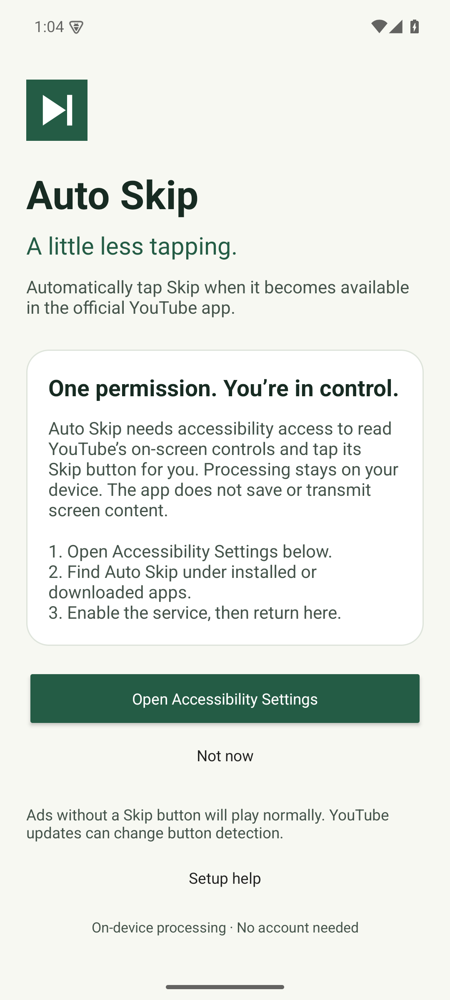
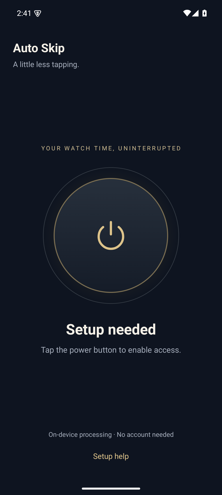
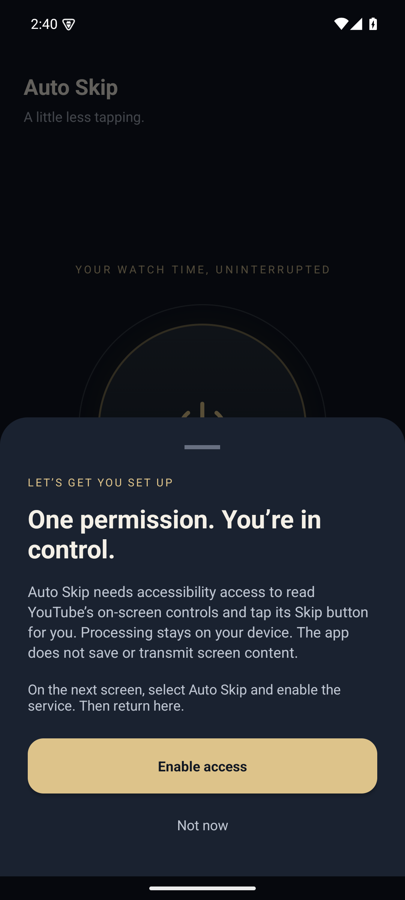

# Auto Skip for Android

A Android utility that removes one repetitive tap from YouTube:
when the YouTube app exposes an enabled Skip button, Auto Skip finds it
through Android Accessibility and presses it for you. It runs on-device, watches
only YouTube, stores no screen content, and gives you one centered power control
to pause or resume the service. It is designed for **Android 8.0+ (API 26)**
phones, tablets and foldables.

  

## What it does

- Explains accessibility access on first launch and opens the system settings.
- Lets you defer setup and enable it later.
- Shows setup status and provides a persistent auto-skip switch.
- Watches YouTube accessibility events and clicks identified Skip controls.
- Processes everything locally, without accounts, analytics or network access.

**Compatibility is provisional.** YouTube controls its interface and can change
the resource identifiers this app uses. Unknown controls are ignored. This app
does not block ads, bypass countdowns, or skip ads without an available button.
The English app interface uses resource strings so translations can be added;
the detector uses resource IDs rather than translated button labels.

## Build

Open this folder in Android Studio, or install a full JDK 17 or newer compatible
with Gradle 9.4.1 and configure `ANDROID_HOME` for your Android SDK. Install SDK
Platform 37 and Android SDK Build-Tools 36.0.0. The project uses Android Gradle
Plugin 9.2.1 and the included Gradle wrapper.

```sh
./gradlew :app:assembleDebug :app:lintDebug
```

APK output: `app/build/outputs/apk/debug/app-debug.apk`.

If your system provides only a Java runtime, set `JAVA_HOME` to Android Studio's
bundled `jbr` folder or another full JDK. Do not commit machine-specific SDK paths.
The first build needs internet access to download build tools and dependencies.
There are no third-party runtime dependencies.

## Install and set up

1. Install the debug APK on your emulator or phone. For a downloaded APK, Android
   may ask you to allow installation from the app opening the file.
2. Open **Auto Skip**. The accessibility explanation appears in a bottom sheet.
3. Tap **Enable access**, find **Auto Skip** in Accessibility Settings, and enable
   the service.
4. Return to the app. The center power button should show **Ready to skip**.
5. Tap the center power button to enable or pause auto-skip, then open the official
   YouTube app and play a video.

### If Play Protect blocks the APK

Play Protect does not provide a per-app disable switch. You can temporarily turn
off its scanning, install the APK, then turn scanning back on immediately:

1. Open **Google Play Store**.
2. Tap your profile picture.
3. Tap **Play Protect**.
4. Tap the gear icon(settings).
5. Turn off **Scan apps with Play Protect**.
6. If shown, also turn off **Improve harmful app detection** temporarily.
7. Install `YT-Ads-Auto-Skipper.apk`.
8. Immediately return to the same menu and turn both settings back on.
9. Run a Play Protect scan afterward.

Google documents this control under **Play Store → Profile → Play Protect →
Settings** in [Google support](https://support.google.com/accounts/answer/9924802).

After installation, Android may still require **Settings → Apps → Auto Skip →
⋮ → Allow restricted settings**. Then enable the Accessibility Service. Only do
this with an APK you built and trust; Accessibility access can read screen content
and interact with other apps. You can revoke access at any time in Android's
Accessibility Settings.

Debug APKs are for development/testing. Before publishing downloadable release
APKs, create and retain your own release signing key using Android Studio's
**Generate Signed App Bundle / APK** flow. Never commit that key or its passwords.
This project is independent of YouTube and Google.

## Checks

Pure-Java matching checks, requiring `java` and `javac` on `PATH`:

```sh
sh tests/check.sh
```

Build the dependency-free Android instrumentation checks:

```sh
./gradlew :app:assembleDebug :app:assembleDebugAndroidTest
```

Start a **disposable emulator**, then run:

```sh
python3 tests/emulator_check.py emulator-5554
```

Replace the serial with the one shown by `adb devices`. This script clears Auto
Skip's data, checks node safety and onboarding, temporarily changes emulator
accessibility settings, verifies enabling/pausing/reopening/revocation, and
restores those settings afterward. It refuses physical-device serials. Screenshots
are saved under `app/build/smoke/`. The custom instrumentation runner is invoked
by this script; use the script rather than Gradle's connected test runner.

See [verification notes](docs/TESTING.md) for actual test results and remaining
device checks. Passing synthetic node checks does **not** establish live YouTube
ad compatibility.

## How it works

`MainActivity` owns onboarding and preferences. `SkipService` subscribes only to
`com.google.android.youtube` events, coalesces bursts, checks the active window,
and scans at most 400 accessibility nodes per pass. `SkipRule` accepts six exact
YouTube resource IDs. Only visible, enabled, clickable matches are acted on, with
an 800 ms delay between successful clicks. No coordinate taps or broad text
matching are used. If the UI changes mid-scan, the service waits for another event.

Screen content is never persisted or transmitted. The app stores only setup and
toggle preferences; backup and device transfer of those preferences are disabled.
The service is protected by Android's `BIND_ACCESSIBILITY_SERVICE` permission.

## Reporting compatibility issues

Include the device model, Android version, YouTube version, YouTube language,
portrait/landscape mode, and whether accessibility and Auto-skip were enabled.
Avoid including account details or private screen content. New detector IDs
should be verified against a real Skip control before adding them.
